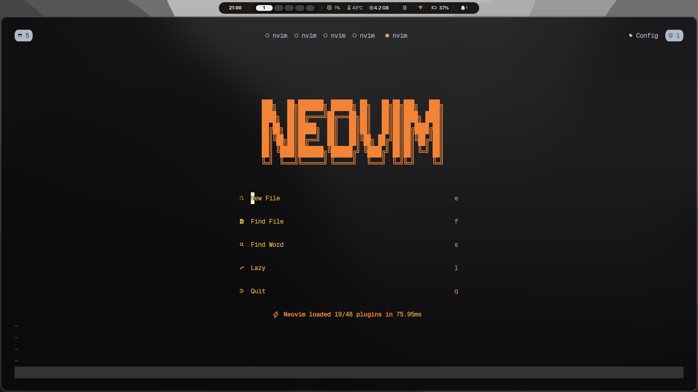
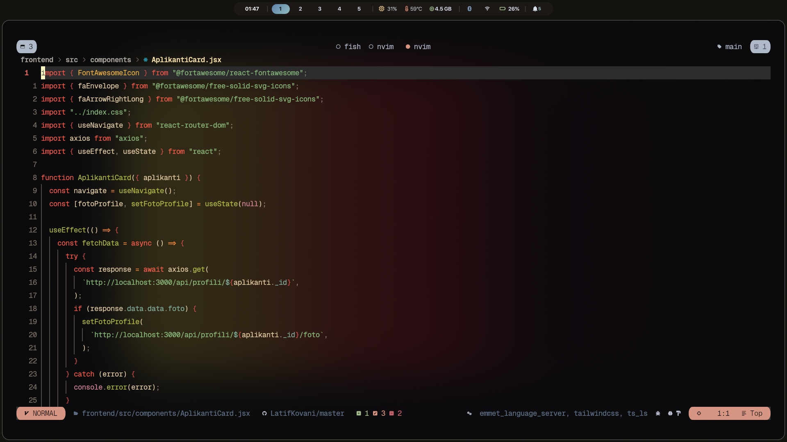

# 🌑 Neovim Config

> A fast, minimal Neovim setup built for modern web development — TypeScript, React, Python, and Lua.


---

## 📸 Showcase

> Dashboard on startup



> Code editing with LSP diagnostics



---

## ⚡ Requirements

- Neovim **0.10+**
- [fzf](https://github.com/junegunn/fzf) — required for fzf-lua picker
- [git](https://git-scm.com/)
- A [Nerd Font](https://www.nerdfonts.com/) — for icons
- Node.js — for TypeScript LSP
- Python 3 — for Python LSP
- `prettierd`, `stylua`, `eslint_d` — installed automatically via Mason

---

## 📦 Installation

```bash
# Back up your existing config first
mv ~/.config/nvim ~/.config/nvim.bak

# Clone this config
git clone https://github.com/LatifKovani/nvim ~/.config/nvim

# Install fzf (Arch)
sudo pacman -S fzf

# Launch Neovim — lazy.nvim will auto-install all plugins
nvim
```

On first launch, run `:Lazy sync` to ensure everything is installed, then restart Neovim.

---

## 🎨 Colorscheme

**[gruvbox-material](https://github.com/sainnhe/gruvbox-material)** with a hard dark background, transparent window, and mix foreground palette. Curly braces are highlighted in a custom red for better visibility.

---

## 🔌 Plugins

### Core

| Plugin                                                    | Purpose                            |
| --------------------------------------------------------- | ---------------------------------- |
| [lazy.nvim](https://github.com/folke/lazy.nvim)           | Plugin manager                     |
| [snacks.nvim](https://github.com/folke/snacks.nvim)       | Notifications, dashboard, input UI |
| [which-key.nvim](https://github.com/folke/which-key.nvim) | Keymap hints                       |
| [noice.nvim](https://github.com/folke/noice.nvim)         | Cmdline popup UI                   |

### LSP & Completion

| Plugin                                                                                   | Purpose                  |
| ---------------------------------------------------------------------------------------- | ------------------------ |
| [nvim-lspconfig](https://github.com/neovim/nvim-lspconfig)                               | LSP configuration        |
| [mason.nvim](https://github.com/mason-org/mason.nvim)                                    | LSP/tool installer       |
| [mason-lspconfig.nvim](https://github.com/mason-org/mason-lspconfig.nvim)                | Mason + lspconfig bridge |
| [nvim-cmp](https://github.com/hrsh7th/nvim-cmp)                                          | Completion engine        |
| [LuaSnip](https://github.com/L3MON4D3/LuaSnip)                                           | Snippet engine           |
| [friendly-snippets](https://github.com/rafamadriz/friendly-snippets)                     | Snippet collection       |
| [tiny-inline-diagnostic.nvim](https://github.com/rachartier/tiny-inline-diagnostic.nvim) | Inline diagnostics       |

### Finder

| Plugin                                         | Purpose                           |
| ---------------------------------------------- | --------------------------------- |
| [fzf-lua](https://github.com/ibhagwan/fzf-lua) | Fuzzy finder for files, grep, LSP |

### Formatting & Linting

| Plugin                                                   | Purpose         |
| -------------------------------------------------------- | --------------- |
| [conform.nvim](https://github.com/stevearc/conform.nvim) | Auto formatting |
| [nvim-lint](https://github.com/mfussenegger/nvim-lint)   | Linting         |

### Git

| Plugin                                                      | Purpose             |
| ----------------------------------------------------------- | ------------------- |
| [gitsigns.nvim](https://github.com/lewis6991/gitsigns.nvim) | Git signs in gutter |
| [lazygit.nvim](https://github.com/kdheepak/lazygit.nvim)    | LazyGit integration |
| [diffview.nvim](https://github.com/sindrets/diffview.nvim)  | Diff viewer         |
| [vim-fugitive](https://github.com/tpope/vim-fugitive)       | Git commands        |

### UI

| Plugin                                                                          | Purpose                   |
| ------------------------------------------------------------------------------- | ------------------------- |
| [lualine.nvim](https://github.com/nvim-lualine/lualine.nvim)                    | Statusline                |
| [barbecue.nvim](https://github.com/utilyre/barbecue.nvim)                       | Winbar breadcrumbs        |
| [nvim-tree.lua](https://github.com/nvim-tree/nvim-tree.lua)                     | File explorer             |
| [indent-blankline.nvim](https://github.com/lukas-reineke/indent-blankline.nvim) | Indent guides             |
| [todo-comments.nvim](https://github.com/folke/todo-comments.nvim)               | Highlighted TODO comments |
| [trouble.nvim](https://github.com/folke/trouble.nvim)                           | Diagnostics list          |

### Editing

| Plugin                                                        | Purpose               |
| ------------------------------------------------------------- | --------------------- |
| [nvim-surround](https://github.com/kylechui/nvim-surround)    | Surround text objects |
| [nvim-autopairs](https://github.com/windwp/nvim-autopairs)    | Auto close brackets   |
| [Comment.nvim](https://github.com/numToStr/Comment.nvim)      | Smart commenting      |
| [substitute.nvim](https://github.com/gbprod/substitute.nvim)  | Quick substitution    |
| [toggleterm.nvim](https://github.com/akinsho/toggleterm.nvim) | Terminal manager      |
| [tmux.nvim](https://github.com/aserowy/tmux.nvim)             | Tmux navigation       |

---

## ⌨️ Keymaps

**Leader key: `Space`**

### Files & Search

| Key          | Action                 |
| ------------ | ---------------------- |
| `<leader>ff` | Find files             |
| `<leader>fr` | Recent files           |
| `<leader>fs` | Live grep              |
| `<leader>fc` | Grep word under cursor |

### LSP

| Key          | Action                     |
| ------------ | -------------------------- |
| `gd`         | Go to definition           |
| `gD`         | Go to declaration          |
| `gR`         | Show references            |
| `gi`         | Show implementations       |
| `gt`         | Show type definitions      |
| `K`          | Hover documentation        |
| `<leader>la` | Code actions               |
| `<leader>ln` | Rename symbol              |
| `<leader>ls` | Restart LSP                |
| `[d` / `]d`  | Previous / next diagnostic |

### Git

| Key          | Action               |
| ------------ | -------------------- |
| `<leader>gl` | Open LazyGit         |
| `<leader>Gp` | Preview hunk         |
| `<leader>Gs` | Stage hunk           |
| `<leader>Gr` | Reset hunk           |
| `<leader>Gd` | Diff HEAD            |
| `]]` / `[[`  | Next / previous hunk |

### Buffers

| Key          | Action          |
| ------------ | --------------- |
| `<Tab>`      | Switch buffers  |
| `<leader>bn` | Next buffer     |
| `<leader>bp` | Previous buffer |
| `<leader>bd` | Delete buffer   |
| `<leader>bm` | Buffer manager  |

### Terminal

| Key          | Action                  |
| ------------ | ----------------------- |
| `<leader>tt` | New float terminal      |
| `<leader>tF` | Toggle float terminal   |
| `<leader>th` | New horizontal terminal |
| `<leader>tv` | New vertical terminal   |
| `<Ctrl-\>`   | Toggle terminal         |

### Splits & Tabs

| Key          | Action           |
| ------------ | ---------------- |
| `<leader>sv` | Split vertical   |
| `<leader>sh` | Split horizontal |
| `<leader>se` | Equalize splits  |
| `<leader>sx` | Close split      |
| `<leader>to` | New tab          |
| `<leader>tx` | Close tab        |

### Notifications

| Key          | Action                |
| ------------ | --------------------- |
| `<leader>nh` | Notification history  |
| `<leader>nd` | Dismiss notifications |

### Diagnostics

| Key          | Action                |
| ------------ | --------------------- |
| `<leader>xw` | Workspace diagnostics |
| `<leader>xd` | Document diagnostics  |
| `<leader>xt` | Todo list             |

### Surround

| Key          | Action                 |
| ------------ | ---------------------- |
| `ysiw"`      | Wrap word with `"`     |
| `ds"`        | Delete surrounding `"` |
| `cs"'`       | Change `"` to `'`      |
| `S` (visual) | Surround selection     |

---

## 🧑‍💻 LSP Servers

Automatically installed via Mason:

- `ts_ls` — TypeScript / JavaScript
- `pyright` — Python
- `lua_ls` — Lua
- `html` — HTML
- `cssls` — CSS / SCSS
- `tailwindcss` — Tailwind CSS
- `emmet_language_server` — Emmet

## 🖋️ Formatters & Linters

Automatically installed via Mason:

- `prettierd` — JS, TS, HTML, CSS, JSON, YAML, Markdown
- `stylua` — Lua
- `black` + `isort` — Python
- `eslint_d` — JS/TS linting
- `pylint` — Python linting
